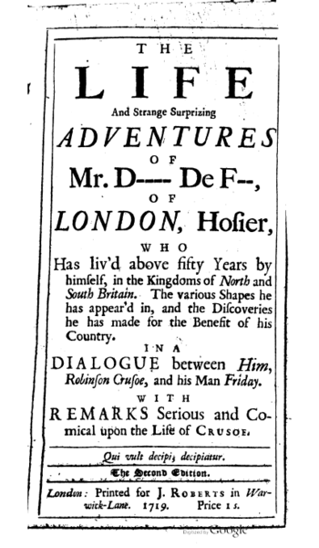
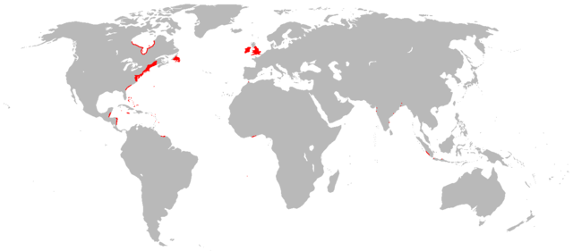
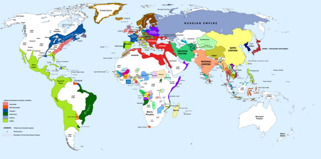
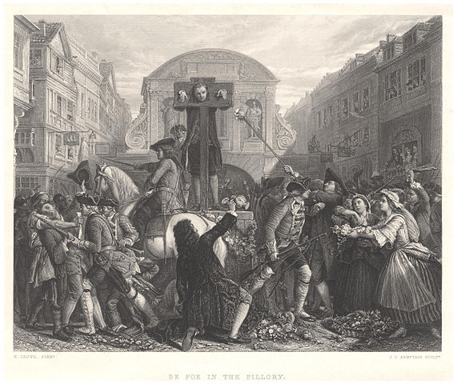

---
title: Daniel Defoe, Robinson a mystifikace
author: Martin "marbu" B.
lang: cs-CZ
papersize: a4
geometry: margin=2.5cm
links-as-notes: false
rights: cc by-sa 4.0
...

K tomu abych se zabýval Danielem Defoe a přečetl jeho Robinsona Crusoe mě
kdysi vyprovokoval pořad Českého rozhlasu [Po stopách Robinsona Crusoe a
dalších britských
výstředníků](https://plus.rozhlas.cz/britsti-excentrici-kteri-zmenili-svet-6602052)
z roku 2015, kde Václav Cílek zmiňuje, že Robinson je ve skutečnosti docela
jiná kniha, než kterou si pamatuje ze základní školy. Když jsem si pak k tomu
dohledával další informace, došlo mi, že jde o mnohem zajímavější téma než bych
původně čekal. Konkrétně v tomto zápisku se dozvíte, co mě zaujalo na
Defoeových mystifikacích a době, ve které žil.

<!--break-->

Tento zápisek (resp. několik zápisků, z kterých právě čtete ten
první) bych ale nedal dohromady, kdybych se z *nějakého důvodu* k Defoovi
nevrátil během minulého roku.
A abych si zjednodušil práci, v textu budu
ignorovat fakt, že Defoe po úspěchu Robinsona napsal ještě další 2 díly (tedy
až na pár výjimek, kdy se mi to naopak hodí).

## Robinson Crusone jako mystifikace

Hned celý název prvního vydání Robinsona, které vyšlo v roce 1719 v Londýně,
stojí za povšimnutí:

> THE LIFE AND STRANGE SURPRIZING ADVENTURES OF ROBINSON CRUSOE, Of YORK,
> MARINER: Who lived Eight and Twenty Years, all alone in an un-inhabited
> Island on the Coast of AMERICA, near the Mouth of the Great River of
> OROONOQUE; Having been cast on Shore by Shipwreck, where-in all the Men
> perished but himself. WITH An Account how he was at last as strangely
> deli-ver’d by PYRATES.

Kromě toho, že takto pojatý podtitul je na dnešní dobu absurdně dlouhý, by
leckomu
mohlo přijít divné, že také v podstatě obsahuje hned několik spoilerů. A tak
před tím, než začneme knihu číst, víme že Robinson ztroskotá na opuštěném
ostrově, jak dlouho tam bude žít a že se nakonec vrátí zpět do civilizace.
Na druhý pohled ale zjistíme, že z pohledu tehdejšího čtenáře o spoilery nešlo,
protože namísto jména autora je uvedeno strohé "Written by Himself".

Stejně tak [původní předmluva](http://www.pierre-marteau.com/editions/1719-robinson-crusoe/rc1-text.html#piii)
vyloženě říká, že kniha popisuje skutečné události a její vydání je vlastně
velkou službou světu:

> The Editor believes the thing to be a just History of Fact; neither is there
> any Appearance of Fiction in it: And however thinks, because all such things
> are disputed, that the Improvement of it, as well as the Diversion, as to
> the Instruction of the Reader, will be the same; and as such he thinks,
> without farther Compliment to the World, he does them a great Service in the
> Publication.

Výše uvedené "spoilery" tak spíše představovaly přehled o čem chce její domnělý
autor vypravovat a vůbec pomáhaly knihu prodat. Ze záměru tímto způsobem
mystifikovat pak logicky vyplývá speciální snaha věnovaná vytváření dojmu, že
to vše domnělý autor po mnoha letech zpětně vypravuje. Např. zvláštní chaos je
v popisu několika dní hned po ztroskotání, které jsou psány jakoby měl údajný
autor problém uspořádat si myšlenky a celá tato sekce je zakončena výpisky z
deníku, který zahrnuje podstatnou část již popsaných událostí a tím pádem
dává čtenáři možnost podívat se na stejné události dvakrát, pokaždé z jiného
pohledu.

Otázkou ale je, jak dlouho byla tato mystifikace brána vážně. První edice
kde je Defoe již uveden jako autor, kterou se mi podařilo dohledat, [vyšla
až roku 1781,](http://pierre-marteau.com/editions/1719-robinson-crusoe/illus/1781-harrisson-ed-title.png)
tedy 50 let po Defoevě smrti. Jelikož jsem ale k tomu došel
zběžným prohlédnutím [galerie ilustrací edicí z 18.
století](http://pierre-marteau.com/editions/1719-robinson-crusoe/illus.html),
a [některé pozdější vydání z téže galerie](http://pierre-marteau.com/editions/1719-robinson-crusoe/illus/1799-manchester-vol1-title.png) stále uvádí variace na *written by
himself*, je třeba tuto poznámku brát s jistou rezervou.
Skutečné autorovo jméno bylo mimochodem prosté *Foe*, aristokraticky znějící
*De* před
jméno přidal později, zřejmě aby si zvýšil společenskou prestiž, a dnešní
tvar *Defoe* se začal používat až po autorově smrti.

Nepředstavujme si ale, že na tuto mystifikaci musel tehdy skočit úplně každý.
Hloubavější čtenář prvního vydání musel o autentičnosti Robinsonovi výpovědi
přinejmenším pochybovat, jak lze doložit např. na kritice od [Charlese
Gildona](https://en.wikipedia.org/wiki/Charles_Gildon) z téhož roku, která již
svým názvem Robinsona paroduje, a nepřímo odhaluje Daniela De Foe jako
skutečného autora:

V první humorné části, která má podobu dialogu, Robinson s Pátkem přepadávají
Daniela Defoe aby si s ním kvůli různým nesmyslům a nekonzistentnostem v románu
vyřídili účty. V druhé části pak Gildon píše dopis autorovi, ve kterém se kromě
již zmíněných nesmyslů strefuje i do jeho politických a náboženských názorů.
Prakticky si tak vyřizuje s Danielem Defoe účty hlavně Gildon. Ale to jsem
trochu odbočil.

Že podobná kritika nebyla ojedinělá je vidět i na tom, ze Defoe měl potřebu
se k takovým námitkám vyjadřovat v [předmluvě ke 2.
dílu](https://quod.lib.umich.edu/e/ecco/004784951.0001.000/1:2?rgn=div1;view=fulltext),
který vyšel ještě téhož roku jako díl první:

> All the Endeavours of envious People to reproach it with being a Romance, to
> search it for Errors in Geography, Inconsistency in the Relation, and
> Contradictions in the Fact, have proved abortive, and as impotent as
> malicious.
>
> The just Application of every Incident, the religious and useful Inferences
> drawn from every Part, are so many Testimonies to the good Design of making
> it publick, and must legitimate all the Part that may be call'd Invention,
> or Parable in the Story.

Defoe sám byl tedy maximálně ochoten přiznat, že některé části příběhu mohou
být smyšlené.
Nedokážu z toho ale říct, jaké procento tehdejších čtenářů opravdu věřilo, že
jde o vzpomínky skutečné osoby.

Je ale vhodné dodat, že Robinsona je možné považovat za jeden z [prvních
anglicky psaných
románů](https://en.wikipedia.org/wiki/List_of_claimed_first_novels_in_English),
a tedy že psát podobná díla tehdy nebylo běžné.

## Časový přehled

Jeden z dalších důsledků této mystifikace je (nebo mi to aspoň tak přijde), že
v knize jsou poměrně přesně uváděny data některých důležitých událostí a tak
můžeme sestavit následující časový přehled a podívat se, jak to Defoovi
vychází:

----  --------------------------------------------------------------------
1632  narození Robinsona Crusoe
1651  začíná děj popisovaný v knize (mimo prvních pár stránek)
1659  Robinson ztroskotá na opuštěném ostrově
1660  narození Daniela Defoe (přibližně)
1686  Robinson opouští ostrov
1687  Robinson se vrací do Anglie
1694  poslední události popisované v knize (mimo poslední stránku)
1719  vychází první vydaní knihy
----  --------------------------------------------------------------------

Vidíme, že první vydání vychází 25 let po posledních událostech z knihy, ale
vzhledem k rychlému přehledu událostí na poslední stránce, které nejsou
datované, spíše méně, řekněme takových 20 let. Z knihy ale také není jasné,
jestli je Robinson v době prvního vydání ještě naživu (kdy by mu bylo už 87
let). Nicméně by měl možnost pracovat na sepisování svého příběhu hned po
návratu do Anglie, kdy by mu bylo 55 let, a první moment, kdy by mohl být
hotov, je krátce po posledních událostech, které v knize popisuje, kdy mu mohlo
být něco mezi 62 a 67 lety (viz výše odhadovaná doba 25 až 20 let od
posledních událostí do prvního vydání). Nejsem si jistý jak moc je něco
takového *uvěřitelné*, ale aspoň je to pořád v mezích teoreticky možného :-)

Zcela záměrně zde ignoruji otázku, zda by člověk musel po 27 letech na
pustém ostrově zešílet (pokud počítám dobře, tak se
Defoe v názvu knihy přepočítal o rok). I když abych byl přesný, tady by
se měla počítat jen doba, kdy byl Robinson na ostrově zcela sám. Datovaní
příchodu Pátka v knize ale trochu nesedí. Na jednu stranu se Pátek objevuje po
zhruba 26 letech od Robinsonova ztroskotání, ale na druhou stranu Robinson
později zmiňuje, že s Pátkem promlouval během zbylých 3 let strávených na
ostrově. Jinými slovy víme, že to bylo v pátek, někdy mezi lety 1683 a 1685 :-)
Na celkovou dobu Robinsonovy samoty to ale ve výsledku nemá velký vliv.

Jinak kdyby letos (v roce 2021) vyšla knížka od autora narozeného v roce 1962,
popisující příběh postavy narozené roku 1934, jejíž děj začíná v roce 1953 a
končí kolem roku 1996, tak bychom ji mohli vnímat už skoro jako historický
román, ale na druhou stranu odstup autora od doby, kterou popisuje, by nebyl
nějak velký. Jiná věc je, jak moc je možné takovou analogii v tomto případě
vůbec použít.

## Historický kontext

Datování použité v knize si také vyloženě říká o propojení s historickými
událostmi. Např. kdybych se vás úplně na začátku zápisku zeptal, kolik let
uplynulo mezi [Bílou Horou](https://en.wikipedia.org/wiki/1620) a narozením
Robinsona Crusoe, tipli byste si 12 let?

V následujícím poměrně subjektivním přehledu, který se soustředí na
[Anglii a dobu Defoova života zhruba do prvního vydání knihy](https://en.wikipedia.org/wiki/Early_modern_Britain#Later_Stuart_era_1660%E2%80%931714),
najdete jak všeobecně známé události, tak věci co mají nějakou souvislost s
Danielem Defoe a zbytkem tohoto zápisku (resp. zápisků).

---------- -------------------------------------------------------------------
1660       narození Daniela Defoe (přibližně), nástup [Karla II.](https://cs.wikipedia.org/wiki/Karel_II._Stuart) na trůn
1660–1688  obnova monarchie (po občanské válce a období republiky) během [Restaurace Stuartovců](https://cs.wikipedia.org/wiki/Restaurace_Stuartovc%C5%AF)
1665-1666  [Velký londýnský mor](https://cs.wikipedia.org/wiki/Velk%C3%BD_lond%C3%BDnsk%C3%BD_mor)
1666       [Velký požár Londýna](https://cs.wikipedia.org/wiki/Velk%C3%BD_po%C5%BE%C3%A1r_Lond%C3%BDna)
1667       drtivé vítězství Holandské flotily nad Britským námořnictvem při [Nájezdu na Medway](https://cs.wikipedia.org/wiki/N%C3%A1jezd_na_Medway)
1678       vznik politických uskupení [Toryů](https://cs.wikipedia.org/wiki/Toryov%C3%A9) a [Whigů](https://cs.wikipedia.org/wiki/Whigov%C3%A9) během [sporů o nástupnictví Jakuba II.](https://en.wikipedia.org/wiki/Exclusion_Bill)
1685       nástup [Jakuba II.](https://cs.wikipedia.org/wiki/Jakub_II._Stuart) na trůn
1687       vychází první vydání Newtonových [Matematických principů přírodní filozofie](https://cs.wikipedia.org/wiki/Philosophiae_Naturalis_Principia_Mathematica)
1688       svržení [krále Jakuba II.](https://cs.wikipedia.org/wiki/Jakub_II._Stuart) během [Slavné revoluce](https://cs.wikipedia.org/wiki/Slavn%C3%A1_revoluce)
1689       nástup [Viléma III.](https://cs.wikipedia.org/wiki/Vil%C3%A9m_III._Oran%C5%BEsk%C3%BD) na trůn
1695       zrušení tiskařského monopolu a cenzury
1701-1714  [Válka o španělské dědictví](https://cs.wikipedia.org/wiki/V%C3%A1lka_o_%C5%A1pan%C4%9Blsk%C3%A9_d%C4%9Bdictv%C3%AD) (největší ozbrojený konflikt první poloviny 18. století)
1702       po smrti [Viléma III.](https://cs.wikipedia.org/wiki/Vil%C3%A9m_III._Oran%C5%BEsk%C3%BD) vládu přebírá královna [Anna Stuartovna](https://cs.wikipedia.org/wiki/Anna_Stuartovna)
1707       [Zákony o unii z roku 1707](https://cs.wikipedia.org/wiki/Z%C3%A1kony_o_unii_z_roku_1707) vedoucí ke sjednocení Anglického a Skotského království
1710       [Zákon královny Anny](https://en.wikipedia.org/wiki/Statute_of_Anne) zavádí moderní pojetí copyrightu
1712       Thomas Newcomen navrhuje [první použitelný atmosférický parní stroj](https://cs.wikipedia.org/wiki/Atmosf%C3%A9rick%C3%BD_parn%C3%AD_stroj)
1719       vychází první vydaní románu Robinson Crusoe
1720       na Londýnské burze praská tzv. [Jihomořská bublina](https://cs.wikipedia.org/wiki/Jihomo%C5%99sk%C3%A1_bublina)
1731       Daniel Defoe umírá
---------- -------------------------------------------------------------------

Už jen z takového strohého přehledu vidíme, že to byla pro Londýn a Anglii
obecně docela krušná a formující doba. Na druhou stranu, která éra byla
idylická, prostá zvratů a katastrof?
Defoe se narodi a žil v Londýně, a tak v dětství na vlastní kůži zažil
poslední velkou morovou epidemii, a o rok později Velký požár ([wikipedia
tvrdí](https://en.wikipedia.org/wiki/Daniel_Defoe#cite_note-west-9), že
většina domů v Defoově sousedství shořela). V dospělosti pak neměl nouzi o
různé politické změny, které se ho více či méně přímo týkaly.
Tyto zvraty už jen dokreslují fakt, že Britové tehdy řešili hlavně svoje
vlastní problémy, největší sláva Britského impéria měla teprve přijít.

Území kontrolované Angličany v roce 1700 
© [Gerrynobody](https://en.wikipedia.org/wiki/User:Gerrynobody)
/ [Wikimedia Commons](https://commons.wikimedia.org/wiki/Main_Page)
/ [CC BY-SA 3.0](https://creativecommons.org/licenses/by-sa/3.0/deed.en)

V rámci své snahy o lepší pochopení historického kontextu se mi podařilo
dohledat i tehdejší politickou mapu světa, kde můžou být některé souvislosti
vidět lépe než na prostém přehledu událostí. Vidíme, že většinu amerického
kontinentu ovládali Španělé, významnou část Jižní Ameriky dále zabírali
Portugalci, zatímco na severu měli svá území Angličané a Francouzi.

Přibližná politická mapa světa v roce 1700 
© [Urnanabha](https://commons.wikimedia.org/wiki/User:Urnanabha)
/ [Wikimedia Commons](https://commons.wikimedia.org/wiki/Main_Page)
/ [CC BY-SA 3.0](https://creativecommons.org/licenses/by-sa/3.0/deed.en)

## Některé další mystifikace Daniela Defoe

Robinson není zdaleka jediným dílem, které Defoe původně nepublikoval pod svým
vlastním jménem. Např. román [Deník morového
roku](https://en.wikipedia.org/wiki/A_Journal_of_the_Plague_Year) byl podobně
jako Robinson Crusoe prezentován čtenáři jako autentický deník z nedávné
minulosti. Oproti Robinsonovi byl ale pravda mnohem blíže realitě.

Kromě románů psal Defoe také satirické básně, eseje a různé pamflety. Celkový
počet mu připisovaných textů [dosahuje
545](https://en.wikipedia.org/wiki/Daniel_Defoe#Writing), ale vzhledem k tomu,
že [za svůj život použil alespoň 198
pseudonymů](https://en.wikipedia.org/wiki/Daniel_Defoe#cite_note-36), můžete
narazit i na jiná čísla. A jak asi tušíte, publikace historických románů
vydávajících se za autentické vzpomínky nemohl být hlavní důvod pro tolik
různých *uměleckých jmen*.
Když se začteme do stránky [Daniel Defoe na
Wikipedii](https://en.wikipedia.org/wiki/Daniel_Defoe), nebo zběžně projdeme
[seznam jeho hlavních děl](https://en.wikisource.org/wiki/Author:Daniel_Defoe),
zjistíme, že Defoe se během svého života věnoval mnoha oblastem. Mimo jiné byl
hlavně obchodníkem, novinářem nebo politickým poradcem, a většinu svých
nejznámějších románů sepsal až v pozdějším věku.

Jedním z důležitých momentů byl pro Daniela Defoe zvrat po smrti
[krále Viléma
III.](https://cs.wikipedia.org/wiki/Vil%C3%A9m_III._Oran%C5%BEsk%C3%BD), pro
kterého Defoe pracoval a na jehož obranu vydal satirickou báseň [The
True-Born Englishman](https://en.wikipedia.org/wiki/The_True-Born_Englishman),
ve které se vysmívá představě o rasové čistotě Angličanů a tím pádem i útokům
na Holandský původ krále. S nástupem královny Anny po Vílémově smrti se ale
zhoršuje situace pro [disentery, odpadlíky od Anglikánské
církve](https://en.wikipedia.org/wiki/English_Dissenters).
[Stávající zákony](https://en.wikipedia.org/wiki/Act_of_Uniformity_1662)
vylučující disentery z vlády a státních služeb začaly být vymáhány daleko
přísněji, a zároveň se začalo diskutovat o nových represích. Defoe,
který jako
[presbitarián](https://en.wikipedia.org/wiki/English_Presbyterianism#Restoration_and_Post-Restoration)
sám mezi disentery patřil, z takového vývoje zcela jistě neměl radost a později
na něj reagoval anonymně vydaným satirickým pamfletem [The Shortest Way with the
Dissenters](https://en.wikipedia.org/wiki/The_Shortest_Way_with_the_Dissenters),
ve kterém sarkasticky napodobuje a dál rozvádí tehdejší útoky na disentery. Ty
obviňuje z mnoha současných a nedávných problémů a dochází k tomu, že dosavadní
zacházení s nimi bylo až příliš mírné a nejlepší by bylo odpadlictví trestat
smrtí. I když to samozřejmě nemyslel vážně, a pouze se snažil upozornit na
přehnaný útlak a útoky proti disenterům, pamflet vyvolal pozdvižení, protože
většina čtenářů tuto satiru nerozpoznala. Někteří radikálnější zastánci
Anglikánské církve začali tento návrh podporovat, zatímco disenteři byli
zděšení kam až útoky proti nim zašly. Když pak později převládl názor, že návrh
nebyl myšlen vážně, zloba obou stran se nasměrovala na anonymního autora
pamfletu. Defoe byl následně jako pravý autor vypátrán a odsouzen k finanční
pokutě, vězení dokud ji nesplatí a 3 dnům pranýřování. Ironie ve veřejné
debatě zdá se nefunguje úplně dobře.

Situace Daniela Defoe byla v tu chvíli zoufalá, jeho obchod v jeho
nepřítomnosti zkrachoval, a splacení pokuty vzhledem k jeho uvěznění
nepřicházelo v úvahu. I tak se ale snažil situaci využít a ve vězení sepsal
báseň *Chvalozpěv na pranýř* ([A Hymn to the
Pillory](https://books.google.cz/books?id=CqhDAQAAMAAJ)), která se pak
prodávala i během jeho pranýřování. Podle legendy pak lidé místo obvyklého
házení kamenů a jiných předmětů na pranýřovaného Defoovi provolávali slávu,
zahrnovali ho květinami a recitovali jeho báseň. Těžko říct, co je na tom
pravdy, ale na druhou stranu muselo být pro něj úspěch už jen to, že pranýřování
ve zdraví přežil :-)

De Foe na pranýři
(James Charles Armytage, public domain)

Defoe se z vězení později dostal díky předsedovi dolní sněmovny a pozdějšímu
ministrovi [Robertu
Harleyovi](https://cs.wikipedia.org/wiki/Robert_Harley,_1._hrab%C4%9B_z_Oxfordu)
a jejich spolupráci, která zahrnovala jak propagandu, tj. psaní pamfletů a
článků za účelem podpory vlády a potírání politických protivníků, tak i
špionážní činnost. Defoe tak mezi lidmi sonduje jejich názory např. na
připravované [sjednocení Anglie se
Skotskem](https://en.wikipedia.org/wiki/Daniel_Defoe#Anglo-Scottish_Union_of_1707)
a aktivně se v této věci zapojuje do veřejné debaty. Přitom překvapivě (alespoň
z mého dnešního ignorantského pohledu) používal poměrně promyšlené metody. Píše
pod mnoha jmény na různých místech. Reaguje v textech sám na sebe, občas si i
odporuje a je kvůli tomu schopný přispívat do opozičních novin, nebo ve svých
vlastních provládních novinách kritizovat vládu, pokud je to pro jeho účely
třeba.

Vděčný příklad zmiňuje Cílek v [kapitole
věnující se Danielu Defoe z knihy Lidé a
dějiny](https://ctenarknih.blogspot.com/2017/10/lide-dejiny.html), že jsem
si jej prostě musel dohledat :-)
Jde o Defoův anonymně vydaný pamflet [The secret history of the White
Staff](https://omeka.lehigh.edu/exhibits/show/crusoe-300/defoe-works/history-white-staff),
který se tváří, že vynáší tajné zákulisí politických jednání, patrně
s cílem podpořit pozici lorda Harleye, o kterém se pak mělo za to, že text sám
na svoji obranu sepsal, i když to on sám veřejně vyvracel.
Později pak Defoe v dalším anonymním pamfletu [The secret history of the secret
history of the White Staff](https://books.google.cz/books?id=mgtgAAAAcAAJ)
odhaluje předchozí pamflet jako podvrh, a mimo jiné v něm uvádí rozhovor údajně
zaslechnutý v
[kavárně](https://en.wikipedia.org/wiki/English_coffeehouses_in_the_17th_and_18th_centuries),
kde se dva lidé dohadují o autorství původního
pamfletu. První zastává názor, že autorem je jistě Harley, nebo spíše
některý z jeho pisálků, jako např. Daniel De Foe, co pro peníze takovou
dřinu rád vykoná, zatímco druhý tomu naopak nevěří a autorovi pamfletu
posléze vysvětluje proč. Lze to chápat buď jako
obranu před odhalením Defoova původního podvrhu nebo jako matení nepřítele.
Zdá se ale, že původní záměr s prvním textem nevyšel, a bylo třeba se od něj
nějak nepřímo distancovat. To na jednu stranu nepůsobí tak bombasticky, jak se
mi zdálo po prvním přečtení Cílkova textu, ale pořád jde o poměrně rafinovaný
postup.

## Závěr

Pokud vás něco z toho, co jsem zde ze svého pohledu stručně popsal, zaujalo
nebo i trochu překvapilo, dost možná vás zaujme některá z referencí.
Případně si lepší už dohledáte sami. Váš výsledný dojem může být nakonec
o něco jiný.
A i když se může nabízet hledání konkrétních analogií s dnešní dobou, zásadní
výhoda (relativně vzdálené) minulosti cizí země je fakt, že se nemusíme
automaticky identifikovat s nějakým tehdejším názorem nebo stranou.
Navíc Defoe je sám o sobě docela rozporuplná osoba, někdy je těžko říct
co si on sám opravdu myslel, a není těžké najít jeho jak pozitivní tak
negativní stránky.

## Reference

Daniel Defoe:

* Heslo [Daniel Defoe](https://en.wikipedia.org/wiki/Daniel_Defoe) na anglické
  Wikipedii
* Pořad Českého rozhlasu *Leonardo Plus* [Po stopách Robinsona Crusoe a dalších
  britských výstředníků](https://plus.rozhlas.cz/britsti-excentrici-kteri-zmenili-svet-6602052)
* BBC Radio Drama [Defoe: Merchant, Writer, Convict,
  Spy](https://www.bbc.co.uk/programmes/b07j7nv3) by Philip Palmer (na webu
  BBC už není tento pořad dostupný, ale dá se sehnat např. [na audible v
  kolekci několika pořadů BBC věnovaným Danielu
  Defoe](https://www.audible.co.uk/pd/The-Daniel-Defoe-BBC-Radio-Drama-Collection-Audiobook/1787533433))
* Kapitola *Daniel Defoe - Autor a jeho hrdina v bludišti světa* od Václava
  Cílka z knihy [Lidé a dějiny](https://www.databazeknih.cz/knihy/lide-a-dejiny-k-roli-osobnosti-v-historii-v-multidisciplinarni-perspektive-355813), ukázka dostupná jako
  [Pan De Foe – první ekonomický žurnalista a mediální
  manipulátor](https://ctenarknih.blogspot.cz/2017/10/lide-dejiny.html)
* Článek [Defoe and the
  Pillory](https://www.todayifoundout.com/index.php/2015/07/this-day-in-history-july-31st-defoe-and-the-pillory/)
  z todayifoundout.com
* Článek [The secret
  agent](https://www.theguardian.com/books/2008/mar/08/fiction.danieldefoe)
  z theguardian.com

Anglický originál Robinsona:

 * [Robinson Crusoe (London: W. Taylor,
   1719)](http://www.pierre-marteau.com/editions/1719-robinson-crusoe.html) z
   pierre-marteau.com, jde o první vydání vůbec, web obsahuje postranní
   vysvětlující poznámky a linkování jednotlivých stránek, viz wiki:
   [DeFoe, Robinson Crusoe (1719):
   Introduction](http://pierre-marteau.com/wiki/index.php?title=DeFoe%2C_Robinson_Crusoe_%281719%29:Introduction)
 * [The Life and Adventures of Robinson Crusoe
   (1808)](http://www.gutenberg.org/ebooks/12623) z guttenberg.org
 * [Robinson Crusoe](https://en.wikisource.org/wiki/Robinson_Crusoe) z
   wikisource.org

Ostatní díla Daniela Defoe zmíněná v textu blogu:

* [A Journal of the Plague
  Year](https://en.wikipedia.org/wiki/A_Journal_of_the_Plague_Year),
  který [začal být v poslední době opět populární](https://theconversation.com/coronavirus-defoes-account-of-the-great-plague-of-1665-has-startling-parallels-with-today-135579)
* [The True-Born
  Englishman](https://en.wikipedia.org/wiki/The_True-Born_Englishman)
* [The Shortest-Way with the
  Dissenters](https://en.wikipedia.org/wiki/The_Shortest_Way_with_the_Dissenters)
* [A Hymn to the Pillory](https://books.google.cz/books?id=CqhDAQAAMAAJ)
* [The secret history of the White
  Staff](https://omeka.lehigh.edu/exhibits/show/crusoe-300/defoe-works/history-white-staff)
* [The secret history of the secret history of the White
  Staff](https://books.google.cz/books?id=mgtgAAAAcAAJ)
