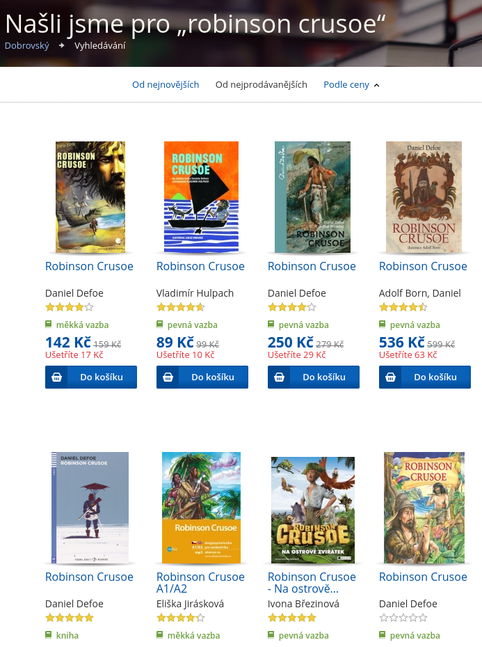

---
title: Defoe, copyright a české verze Robinsona Crusoe
author: Martin "marbu" B.
lang: cs-CZ
papersize: a4
geometry: margin=2.5cm
links-as-notes: false
rights: cc by-sa 4.0
...

V druhém zápisku věnovaného Danielu Defoe se podíváme na vliv autorského
zákona na jeho nejznámější dílo, a pokusíme se vyznat v jeho českých překladech
a převyprávěních. A i když by se mohlo na první pohled zdát, že Robinson a
copyright nemají nic společného, najdeme tu hned několik zajímavých souvislostí.

<!--break-->

## Defoe a Copyright

Zajímavé je, že Robinson vychází "pouhých" 9 let potom, co v roce 1710
vešel v platnost [Zákon královny
Anny](https://en.wikipedia.org/wiki/Statute_of_Anne),
který vůbec poprvé zavádí koncept autorského práva regulovaného státem a je
tak považován za počátek dnešního pojetí copyrightu.
A nebyl by to Defoe, aby se veřejné debaty, která tomuto zákonu předcházela,
aktivně neúčastnil.

Pojďme si ale nejprve stručně popsat situaci předcházející přijetí tohoto
zákona. Regulace knihtisku byla v Anglii zpočátku motivována snahou o cenzuru
z pohledu církve a státu "nevhodných" textů.
V roce 1557 získává tiskařská společnost/cech [Stationers'
Company](https://en.wikipedia.org/wiki/Worshipful_Company_of_Stationers_and_Newspaper_Makers)
monopol na tisk a distribuci knih, ale také na ni zároveň vláda deleguje
část zodpovědnosti za cenzuru tisku. Termín *copyright* pochází právě
z této doby, byl ale chápán jako právo tiskaře, člena *Stationers'
Company*, na tisk u Stationer's registrovaného díla (ostatní členové byli v
rámci společnosti zavázáni, že nebudou publikovat registrovaná díla ostatních
členů, a žádná jiná společnost díky monopolu *Stationers'* tisknout knihy vůbec
nemohla). Práva samotných autorů tehdy nikdo neřešil.

Společnost *Stationer's* tedy měla zájem na udržování cenzury, protože s ní byl
zároveň udržován její tiskařský monopol. Míra cenzury a způsob fungování se
postupně spolu s politickou situací měnila, ale základní princip této
spolupráce byl zachován. Z našeho pohledu je zajímavá až [změna z roku 1662,
kdy byl tento monopol zakotven v zákoně o licencování
tisku](https://en.wikipedia.org/wiki/Licensing_of_the_Press_Act_1662),
ale zároveň s tím časově omezen na 2 roky, takže se pak musela jeho platnost
opakovaně obnovovat. Souběžně totiž s tímto systémem sílila nespokojenost, až
v roce 1695 parlament odmítl zákon o licencování tisku prodloužit, a tím tak
tiskový monopol, cenzuru a tehdejší pojetí copyrightu prakticky zrušil. To na
jedné straně způsobilo dočasně chaos, ale na druhou stranu dalo vzniknout novým
knižním vydavatelům, distributorům a novinám.

První významné dílo Daniela Defoe
[An Essay Upon Projects](https://en.wikipedia.org/wiki/An_essay_upon_projects)
vychází v roce 1697, tj. zhruba 3 roky po zrušení cenzury a monopolu
*Stationer's*. Asi není těžké vidět, že bez této změny by to Defoe měl s
vydáváním svých děl výrazně složitější. Zároveň je zajímavé uvědomit si, že v
období, kdy se Defoe věnoval psaní politických textů, byla svoboda tisku v této
podobě relativně nová věc. Ostatně podobně jako celá tehdejší politická
situace. Nechci tím ale tvrdit, že by tohle byl jediný důvod, proč se Defoe
začal věnovat literární tvorbě.

Zamítnutí prodloužení starého zákona o licencování tisku a následné právní
vakuum nemohlo vyhovovat jak Stationer's, novým tiskařským firmám ani samotným
autorům, a tak přirozeně odstartoval boj o novou podobu copyrightu, který trval
téměř 15 let. Daniel Defoe se během této doby k věci opakovaně vyjadřoval jak v
samostatných textech tak později novinových příspěvcích. Ve svém [Eseji o
regulaci tisku](https://www.copyrighthistory.org/cam/tools/request/showRecord.php?id=commentary_uk_1704)
z roku 1704 věnuje Defoe nejvíce prostoru problematice svobody tisku a kritice
svévolné cenzury, ale zároveň zdůrazňuje i důležitost řešení problému tzv.
*tiskového pirátství* (press-piracy). Řešení obou těchto problémů Defoe vidí
jako nutné pro obecně prospěšnou podporu vzdělanosti v Anglii. Jako *tiskový
pirát* byl tehdy chápán vydavatel, který tiskl a prodával cizí knihy, aniž by
původní autor z toho něco měl. Defoe speciálně zmiňuje nešvar odvozených
zkrácených verzí, které *pirátský vydavatel* nechá zpracovat na základě původní
obsáhlé knihy, a vydává jako alternativu za zlomek ceny.
Defoe v eseji navrhuje namísto nepredikovatelné cenzury, zákonem jasně
definovat co přesně a jak je trestné, a zároveň zavést princip autorského
vlastnictví knihy s tím, že bude zákonem přikázáno na každé knize uvést autora,
vydavatele a knihkupce. V eseji se také pozastavuje nad tím, že na jednu stranu
je autor zodpovědný za svoje dílo a může být za něj potrestán, ale na druhou
stranu zastání proti pirátským vydavatelům nemá. Čemuž se vzhledem k jeho
zkušenostech nelze divit. Zatímco byl zavřený za svůj pamflet o disenterech,
mohl tehdy teoreticky kdokoli dát tento pamflet nebo *Chvalozpěv na pranýř* bez
jeho souhlasu tisknout a prodávat, aniž by tím porušil zákon.

Nová podoba copyrightu zavedená *Zákonem královny Anny* představovala kompromis
přijatelný pro všechny tehdejší strany, a byla zdůvodněna podporou vzniku a
šíření knih a vzdělanosti obecně.
Místo vydavatelů se držiteli práv k rozmnožování děl stali samotní autoři,
kteří je mohli licencovat vydavatelům.
Byl odstraněn monopol *Stationer's*, kteří alespoň dostali za úkol vést
[registr autorských děl](https://en.wikipedia.org/wiki/Stationers%27_Register),
kam musel autor své dílo registrovat, aby byl jeho copyright právně závazný.
Ten trval 14 let, a pokud byl autor po této době stále naživu, mohl požádat o
prodloužení o dalších 14 let. Pak se se dílo stalo volným (public domain).
Tato délka copyrightu vydržela až do roku
[1842](https://en.wikipedia.org/wiki/Copyright_Act_1842). Zajímavé je, že zákon
explicitně řešil jen knihy a jejich přesné kopie, na odvozená díla se copyright
nevztahoval.

&lt;spekulace&gt;
A jakým způsobem tento výsledek ovlivnil Defoovo další dílo? Většina jeho textů
byla publikována až v době platnosti nového zákona, což by mohlo něco
naznačovat, ale o nějaké skutečné srovnání jsem se nepokoušel. I tak se dá
říct, že Defoeho nová situace k psaní spíše motivovala než odrazovala.
Kdyby tento zákon býval obsahoval závaznou povinnost uvést autora knihy (jak
původně navrhoval), nejsem si jist zda by i později pokračoval ve vydávání knih
anonymně pod různými uměleckými jmény (už jen tím by totiž porušil zákon, kdyby
se jeho návrh ujal).
&lt;/spekulace&gt;

Nicméně
vzhledem k tomu, že Defoe své dílo publikoval pod Robinsonovým jménem, by mě
docela zajímalo, zda a jak případně řešil autorskoprávní spory s *pirátskými
vydavateli* své nejpopulárnější knihy. Nepředpokládám že by se pro tyto případy
vydával osobně za Robinsona, i když on by toho asi byl i schopný. Možná
to řešil přes svého vydavatele, se kterým se musel osobně znát, a nebo to možná
neřešil (nebo nemusel řešit) vůbec. Kdo ví? Zdá se ale, že velká část tiskařů,
se kterými by se mohl Defoe chtít přít, stejně vydávala [výrazně zkrácené edice
Robinsona](https://scolarcardiff.wordpress.com/2016/11/16/robinson-crusoe-in-36-pages/)
více méně v mezích *Zákona královny Anny*. A jak už jsem zmiňoval výše, to
nemohlo Daniela Defoe vůbec těšit. Lze to vidět i na tom, že kritice zkrácených
verzí věnoval zhruba polovinu [předmluvy k 2. dílu Robinsona
Crusoe](https://quod.lib.umich.edu/e/ecco/004784951.0001.000/1:2?rgn=div1;view=fulltext):

> ... this makes the abridging this Work, as scandalous, as it is knavish and
> ridiculous, seeing, while to shorten the Book, that they may seem to reduce
> the Value, they strip it of all those Reflections, as well religious as
> moral, which are not only the greatest Beautys of the Work, but are
> calculated for the infinite Advantage of the Reader.
>
> By this they leave the Work naked of its brightest Ornaments; and if they
> would, at the same Time pretend, that the Author has supply'd the Story out
> of his Invention, they take from it the Improvement, which alone recommends
> that Invention to wise and good Men.
>
> The Injury these Men do the Proprietor of this Work, is a Practice all honest
> Men abhor; and he believes he may challenge them to shew the Difference
> between that and Robbing on the Highway, or Breaking open a House.
>
> If they can't shew any Difference in the Crime, they will find it hard to
> shew why there should be any Difference in the Punishment: And he will
> answer for it, that nothing shall be wanting on his Part, to do them Justice.

Takovéto zjednodušené adaptace se rychle staly velice populární. A to nejen
vzhledem k úrovni tehdejší vzdělanosti.

## České překlady a adaptace

K českým čtenářům se Robinson dostal s výrazným zpožděním a navíc nepřímo,
skrze německé
překlady a adaptace. Takovou populární německou adaptací byl např. *Mladší
Robinson*. Ten podobně jako jiné oblíbené převyprávění Robinsona vychází z
původního Defoova díla jen volně, některé prvky díla vypouští a mnohé výrazně
mění. A jak je z názvu patrné, *Mladší Robinson* byl určen dětem, zatímco Defoe
svého Robinsona cílil na dospělé čtenáře, samostatná literatura pro děti tehdy
ještě neexistovala.

Pokud budeme jako *české překlady* chápat pouze díla, u kterých jejich
překladatel vychází z původního anglického Defoova textu, a která jsou zároveň
převedena do češtiny bez zanášení výrazných změn, tak první takové vzniká až
téměř 100 let po první české adaptaci, a celkově existují takové české překlady
jen dva.
Přímému věrnému českému překladu ještě v 18. století bránilo několik faktorů.
Když pominu pomalejší přenos informací daný stavem technologií a mezinárodních
vztahů, tak na tehdejším knižním trhu mnoho prostoru pro české knihy nebylo
(první fáze [národního obrození](https://cs.wikipedia.org/wiki/%C4%8Cesk%C3%A9_n%C3%A1rodn%C3%AD_obrozen%C3%AD#Periodizace_n%C3%A1rodn%C3%ADho_obrozen%C3%AD)
probíhá až zhruba v poslední čtvrtině 18. století).
A i kdyby tenkrát nějakým zázrakem vznikl věrný český
překlad, v barokně katolických Českých zemích 18. století by dílo
protestantského autora narazilo minimálně na Jezuity a státní cenzuru.

---- -------------------------------------------
1719 původní Defoův *Robinson Crusoe*
1779 populární německá adaptace *Robinson der Jüngere* [Joachima Heinricha Campa](https://cs.wikipedia.org/wiki/Joachim_Heinrich_Campe)
1797 *Mladší Robinson*, první česká verze vůbec, překlad německé adaptace *Robinson der Jüngere*
1894 [první český překlad](http://kramerius.nkp.cz/kramerius/MShowMonograph.do?id=16160) [A. M. Lounského](https://cs.wikisource.org/wiki/Autor:Anton%C3%ADn_Moj%C5%BE%C3%AD%C5%A1) a [Jaroslava Svákovského](https://cs.wikipedia.org/wiki/Jaroslav_Sv%C3%A1kovsk%C3%BD)
1920 překlad [Alberta Vyskočila](https://cs.wikipedia.org/wiki/Albert_Vysko%C4%8Dil)
---- -------------------------------------------

Tady je nutné dotat, že Robinson od Lounského a Svákovského není obecně
považován za 100% věrný překlad, ale do takových detailů nechci zabíhat (týká
se to především Defoova nelichotivého popisu Ruska v 2. dílu, který nebyl pro
českého překladatele 19. století přijatelný). Sám
nemohu soudit, protože tuto verzi jsem nečetl, ale pro účely tohoto zápisku,
který další díly Robinsona stejně ignoruje, ji budu za překlad považovat.

Dodnes celkem vyšlo něco přes 110 českých edic Robinsona Crusoe, a zorientovat
se v nich mi nejprve dělalo docela problém. Naštěstí jsem později narazil na
použitelný přehled z roku 2006 v [bakalářské práci Lucie
Seibertové](https://is.muni.cz/th/sfzsc/). S pomocí [katalogu národní
knihovny](https://aleph.nkp.cz/F/?func=file&file_name=find-b&local_base=nkck)
jsem jej doplnil o verze vydané po roce 2006, a výsledný seznam pro potřeby
tohoto zápisku rozdělil do několika hlavních kategorií a zobrazil v grafu.
Výsledek tak nemusí být zcela konzistentní, správný nebo úplný, ale pro
základní představu to stačí.

Každý záznam na ose x reprezentuje jedno desetiletí (např. hodnota 1900
zastupuje interval od roku 1900 do 1909 včetně), zatímco na ose y je zobrazen
počet *různých vydání* během této doby. To nám sice přímo nic neříká o tom,
kolik výtisků vlastně dohromady vyšlo, ale na druhou stranu to stačí na
ilustraci vývoje kategorií vydání a nabídky v čase.
Kategorie *neurčeno* ve většině případů znamená nějakou adaptaci nebo
přinejlepším hodně volný překlad, ale vzhledem k tomu, že ostatní adaptace jsou
určené přesněji, jsem je do adaptací v grafu nepočítal.

Převaha adaptací nad překlady je tu jasně patrná. Jen zhruba 16 % vydání jsou
edice výše zmíněných dvou věrných překladů. Pro srovnání by bylo zajímavé
udělat podobný přehled i pro Spojené království. Jak jsem už zmínil,
volné adaptace tu byly populární ještě za Defoova života, a převahu původního
textu bych dnes ani v Anglii nečekal. Různých verzí Robinsonova příběhu tedy
existuje a vždy existovalo velké množství.
Obecně se dá navíc říct, že naprostá většina dnešních adaptací Robinsona je
cílena na děti, a jak je vidět na příkladu *Mladšího Robinsona*, má tento
přístup dlouhou tradici.

V grafu je vidět peak během 30. a 40. let minulého století, kdy vyšlo výrazně
více edic Robinsona než v předchozích a následujících dekádách.
Zajímavé také je, že ve 40. letech tvoří překlady polovinu všech tehdy vydaných
edic. Po válce pak naopak vidíme pokles jak v počtu tak různorodosti vydaných
edic, až se nakonec tehdejší režim rozhodne vydávat především adaptaci Josefa
Věromíra Plevy, která v počtu vydání dodnes jednoznačně dominuje. Navzdory tomu
ale každé desetiletí komunistické totality alespoň jednou vyjde Vyskočilův
věrný překlad, a první dekádou, kdy Vyskočilův překlad zcela chybí, jsou
paradoxně až 90. léta.  Převaha Plevovi adaptace je dodnes znát. Za minulého
režimu byla tato verze na seznamu povinné četby pro základní školy, a v čítance
jsme úryvek z ní měli ještě někdy v 90. letech (jak si sám zpětně vybavuju).
Podobně [na české wikipedii je shrnutí děje postaveno na Plevově verzi
](https://cs.wikipedia.org/wiki/Robinson_Crusoe#D%C4%9Bj) a změny oproti
Defoově originálu jsou popsány stručně z pohledu tohoto převyprávění. Pokud
jste někdy v dětství Robinsona četli, je velká pravděpodobnost, že jste měli v
ruce právě tuto adaptaci.

Tady bych si dovolil malé odbočení k způsobu, jakým se u nás zachází v
knihkupectvích a na obalech knih s překladateli. Častokrát nalézáme jejich
jméno uvedené až uvnitř knihy, jakoby mimochodem mezi údaji o roku vydání nebo
nákladu. Přitom překladatel se zásadním způsobem podílí na tom, co si čtenář z
díla odnese, a zasloužil by si tak na titulní straně a obalu knihy
téměř stejnou pozornost jako samotný autor. Ostatně překlad je sám o sobě
autorské dílo, na které se vztahuje samostatný copyright.

V případě adaptací Robinsona se v poslední době naštěstí většinou na obálce
knihy uvádí spolu s Danielem Defoe i autor samotného převyprávění. Způsob
provedení se může lišit, ale při bližším pohledu z něj pochopíte o jakou knihu
jde. Viz např. obálky
[Plevovy adaptace z roku 1956](https://www.obalkyknih.cz/view?nbn=cnb000725170)
(tj. i když tato verze dočasně vytlačila ostatní, byla alespoň už přímo na
obálce označena jako převyprávění),
[Novotného adaptace z roku 2014](https://www.obalkyknih.cz/view?isbn=9788000036410)
nebo
[Hulpachovy adaptace z roku 2012](https://www.obalkyknih.cz/view?isbn=9788073887339).

Občas lze ale narazit na adaptace pro které to neplatí, a jako autor je uveden
Defoe, nebo autorství není na obálce vůbec označeno (např. [Pleva z roku
1973](https://www.obalkyknih.cz/view?oclc=(OCoLC)42101256&nbn=cnb000461382)),
což mi v případě Robinsona nepřijde úplně šťastné. Případně do toho vnese
zmatek e-shop, ve kterém jsou položky pro autora vyplněny více méně náhodně.

Např. na následujícím screenshotu z obchodu
[knihydobrovsky.cz](https://www.knihydobrovsky.cz) v levém horním rohu vidíme
komixovou adaptaci, kde je jako autor uveden Defoe, zatímco Vyskočilův věrný
překlad v pravém horním rohu má jako hlavního autora uvedeno jméno ilustrátora
Adolfa Borna. Mezi nimi jsou pak 2 adaptace, kdy jednou je uvedeno jméno autora
adaptace, zatímco podruhé je jako autor opět uveden Defoe. Rozbor druhého řádku
ponechávám čtenáři jako cvičení (-:

Ale celkově musím přiznat, že je v tom daleko menší zmatek, než jsem si původně
myslel. Ne, že bych proti adaptacím obecně něco měl. Naopak je to známka
popularity díla a fungující svobodné kultury. Zvlášť v případě Robinsona, který
svoji pozici v povědomí lidí postupně vydobyl spíše adaptacemi než původním
textem. A to aniž bych to toho počítal [žárn
robinsonád](https://cs.wikipedia.org/wiki/Robinzon%C3%A1da), tedy děl s
trosečníkem v hlavní roli, kterých vzniklo ještě mnohem víc. Ale prezentovat
adaptace pod jménem autora předlohy mi přijde poměrně zvláštní i u volného
(public domain) díla.

Jak je z toho všeho patrné, současná slabá nabídka překladů je vlastně docela
přirozená. Když nakladatelství Albatros plánovalo znovu vydat všechny knihy
ilustrované
[Zdeňkem Burianem](https://cs.wikipedia.org/wiki/Zden%C4%9Bk_Burian), pro edici
Robinsona se místo překladu raději šlo cestou nové adaptace, které se ujal
[František
Novotný](https://cs.wikipedia.org/wiki/Franti%C5%A1ek_Novotn%C3%BD_(spisovatel)).
Vyskočilův překlad, který po roce 1989 vyšel pouze jednou, je tak dnes spíše
rarita. Zajímalo by mě, kolik lidí vlastně u nás Vyskočilův překlad vůbec
četlo, nebo aspoň vědělo, že nějaký překlad existuje. Hádám, že významná část
čtenářů alespoň tuší, že četlo místo původní verze resp. překladu nějakou
adaptaci.

Když jsem vzal do ruky poslední vydání Vyskočilova překladu z roku 2016,
nepřekvapila mne absence jména překladatele na [obálce
knihy](https://www.obalkyknih.cz/view?isbn=9788075054920), ale následující
poznámka, která je uvedena na jedné z prvních stránek, spolu s jmény
překladatelů:

> Nakladateli se přes veškeré úsilí nepodařilo najít autory překladu ani jejich
> případné dědice. Pokud existují, nechť nakladatele laskavě kontaktují.

Na překlad samotný totiž platnost autorských práv vyprší až v roce 2036. V
době, kdy Vyskočil svůj překlad vydával, ale [platnost copyrightu trvala jen 50
let od smrti autora](https://wikisofia.cz/wiki/Autorsk%C3%A9_pr%C3%A1vo), a
pokud by později nedošlo k jejímu prodloužení, byl by tento překlad volným
dílem již od roku 2016. Tím ale není, a tak si nejsem jistý, jak mám výše
uvedenou poznámku chápat. Vydalo takto nakladatelství tento překlad bez
licence, a sází na to, že se případně dohodne mimosoudně, nebo že jej nikdo
nezažaluje, protože by se nejprve musel najít soudně potvrzený dědic autorských
práv?

Jinak tohle je problém hlavně u méně známých autorů publikujících do
roku 1948, kteří byli následně potlačeni komunistickým režimem. Po roce 1989
totiž nemusí být jasné, kdo autorská práva na zapomenutá díla vydaná za první
republiky vlastně drží.
Veřejná instituce (např. knihovna) může použít speciální vyjimku pro tzv.
[osiřelá díla](https://cs.wikipedia.org/wiki/Osi%C5%99el%C3%A9_d%C3%ADlo), a
po splnění všech podmínek dílo zpřístupnit v digitální podobně.
Komerční vydavatel ale takovou možnost nemá, a jak vidíme na příkladu
Vyskočilova překladu, může po neúspěšném hledání dědiců buď dílo nevydat, nebo
autorský zákon porušit a dílo vydat na vlastní riziko.
V obou případech mi ale přijde, že copyright v podstatě jen zbytečně zvyšuje
byrokratickou zátěž nutnou pro zachování dnes zapomenutých dříve zakázaných
děl.

Překvapuje mě ale, že i u poměrně známého díla, jakým Robinson je, narážíme na
stejný problém. Přímo se tak nabízí hypotéza, že propad počtu vydání
Vyskočilova překladu po roce 1989 je částečně způsoben právě tímto. Nicméně
podle [národní knihovny](https://aleph.nkp.cz) vyšlo po roce 1989 hned několik
jiných Vyskočilových děl, takže bych čekal, že problém dědictví autorských práv
už byl dříve řešen. Navíc jak jsem se už zmiňoval, poptávka po překladu není
nijak velká, a tak důvody poklesu vydání Vyskočilova překladu budou o něco
složitější.

Osobně mi přijde, že současná délka copyrightu je příliš dlouhá a že čeští
autoři vydávající do roku 1948, u kterých dnes není jasné vlastnictví
autorských práv, by si zasloužili nějaké systémové řešení v českém autorském
zákoně. Možná by tento problém šel řešit tak, že by se původní délka platnosti
copyrightu, tj. 50 let po smrti autora, dodržovala u děl, u kterých se dědicové
v době překročení tohoto milníku stále nenašli. Naopak pokud by dědicové k dílu
přihlásili, např. jeho vydáním v jakékoli podobě, zůstala by v platnosti
dnešní lhůta 70 let. Ideální by bylo vůbec takto dlouhý copyright nemít, ale
jak se říká *that ship has sailed*.

## Reference

Daniel Defoe:

* Heslo [Daniel Defoe](https://en.wikipedia.org/wiki/Daniel_Defoe) na anglické
  Wikipedii
* Pořad Českého rozhlasu *Leonardo Plus* [Po stopách Robinsona Crusoe a dalších
  britských výstředníků](http://prehravac.rozhlas.cz/audio/3332404)

Defoe a tehdejší regulace knihtisku:

* Defoův text z roku 1704: [An Essay on the Regulation of the
  Press](http://www.luminarium.org/renascence-editions/defoe2.html)
* Článek [Commentary on: Defoe's Essay on the
  Press](http://www.copyrighthistory.org/cam/tools/request/showRecord.php?id=record_uk_1704)
  z copyrighthistory.org
* Článek [The Pirated
  Crusoe](https://crusoeat300.com/who-owns-a-text-robinson-crusoe-as-a-test-case-for-copyright-law/)
  z crusoeat300.com
* Zápisek [Robinson Crusoe in 36
  Pages](https://scolarcardiff.wordpress.com/2016/11/16/robinson-crusoe-in-36-pages/)
  o zkrácených edicích Robinsona vydávaných v Anglii
* Analýza [Press Piracy from Tonson v. Baker to Cary v.
  Kearsley](https://earlybookmarket.com/press-piracy.html)
  z projektu earlybookmarket.com

České překlady a adaptace Robinsona:

* Odstavec [České překlady a adaptace](https://cs.wikipedia.org/wiki/Robinson_Crusoe#%C4%8Cesk%C3%A9_p%C5%99eklady_a_adaptace)
  na Wikipedii
* Starší [adaptace Robinsona](https://cs.wikisource.org/wiki/Robinson_Crusoe)
  na Wikizdrojích
* Bakalářská práce Lucie Seibertové [Bibliography of Czech translations and
  adaptations of Daniel Defoe's novel Robinson
  Crusoe](https://is.muni.cz/th/sfzsc/)
* [Rozhovor s Františkem Novotným](https://plus.rozhlas.cz/co-se-stal-kdyby-se-nerozpadlo-rakousko-uhersko-asi-bychom-byli-stastnejsi-rika-7595044),
  autorem adaptace z roku 2005

Ostatní díla Daniela Defoe zmíněná v textu blogu:

* [An Essay Upon Projects](https://en.wikipedia.org/wiki/An_essay_upon_projects)
* [The Shortest-Way with the
  Dissenters](https://en.wikipedia.org/wiki/The_Shortest_Way_with_the_Dissenters)
* [A Hymn to the Pillory](https://books.google.cz/books?id=CqhDAQAAMAAJ)

<!-- Anketa

Četli jste Robinsona v češtině?

- ano
- ne

Pokud jste Robinsona v češtině četli, o jakou verzi šlo?

- Vyskočilův překlad
- adaptaci Josefa Věromíra Plevy
- adaptaci Františka Novotného
- některou jinou adaptaci (napíšu do diskuze kterou)
- některou jiný překlad (napíšu do diskuze který)
- už nevím co to bylo za verzi

Pokud jste četli některou z českých adaptací, věděli jste, že jde o adaptaci a
ne o překlad?

- ano
- ne

-->
