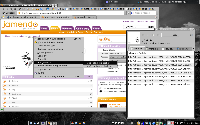

Nedávno jsem znovu objevil [Jamendo](http://www.jamendo.com) a jako
uživatel konqueroru a
[mpd](http://www.abclinuxu.cz/software/multimedia/audio/prehravace/mpd)
jsem se je pokusil všechny tři donutit k spolupráci. :-) Idea byla
vytvořit pro konqueror nové service menu, které by přidalo album na
playlist music player daemona - ten by tak mohl streamovanou hudbu
přehrávat. Pro jasnějsí představu následuje screenshot.

<!--break-->

[](108844-mpd--konqueror-a-jamendo-22874.png)

Po nedávném [redesignu
Jamenda](http://www.e-ott.info/2008/01/28/nova-verze-jamenda/) se mi ale
v konqueroru nepodařilo najít přímý odkaz na žádný playlist. Naštěstí
ale Jamendo nabízí hezké rozhraní
[MusiclistApi](http://developer.jamendo.com/en/wiki/MusiclistApiExamples#),
díky kterému není získání playlistu problém. Následující bash skript
očekává url jamendího alba, které přidá do playlistu mpd. Pokud jako
první parametr uvedete `-p`, nejprve současný playlist smaže a po
přidání nového hned začne přehrávat.

``` {.kod}
#!/bin/bash
NAME=mpc.jamendo.add

BASE_URL="http://www.jamendo.com/"
PLAY_URL="http://www.jamendo.com/get/track/id/album/audio/play/"

if [[ $# -eq 0 ]]; then
    echo -e "$NAME -- simple jamendo interface for mpd\
            \nusage: $NAME [-p] jamendo_url"
    exit
fi

if [[ "$1" == "-p" ]]; then
    PLAY=0
    shift
fi

if [[ "$1" =~ ^${BASE_URL}.*album/([0-9]*)/?$ ]]; then
    NUMBER=${BASH_REMATCH[1]}
else
    echo "wrong URL" >&2
    exit 1
fi

[[ $PLAY ]] &&  mpc clear;
wget -O - ${PLAY_URL}${NUMBER} | mpc add
[[ $PLAY ]] &&  mpc play;
```

Poznámky: Nebyl by asi problém mpc nahradit jiným přehrávačem, který
rozumí formátu [m3u](http://en.wikipedia.org/wiki/M3U), případně ještě
[XSPF](http://www.xspf.org/) (viz
[MusiclistApi](http://developer.jamendo.com/en/wiki/MusiclistApiExamples#)).
Streamuje se ve formátech mp3 a ogg, ale bohužel [mpd trpí
bugem](http://www.musicpd.org/mantis/view.php?id=1487), který omezuje
volbu na mp3.

Teď už stačí vytvořit [service
menu](http://developer.kde.org/documentation/tutorials/dot/servicemenus.html)
pro konqueror, které bude spouštět výše uvedenž skript. Do adresáře
`~/.kde/share/apps/konqueror/servicemenus` přidáme soubor
`jamendo.desktop` s následujícím obsahem:

``` {.kod}
[Desktop Entry]
ServiceTypes=text/html
Actions=jamendo_play;jamendo_add
X-KDE-Priority=TopLevel
X-KDE-Submenu=mpc &Jamendo

[Desktop Action jamendo_add]
Name=vložit na konec playlistu
Exec=~/bin/mpc.jamendo.add %u 2>&1 /dev/null

[Desktop Action jamendo_play]
Name=vložit playlist a přehrát
Exec=~/bin/mpc.jamendo.add -p %u 2>&1 /dev/null
```

Dobrý nápad je zkontrolovat si cestu (případně i název) k
`skriptu mpc.jamendo.add`.

Btw na ArchLinuxím fóru jsem narazil na [cli
rozhraní](http://bbs.archlinux.org/viewtopic.php?id=42618&p=1) k Jamendu
napsané v [bashi](http://www.jamendo.com/en/album/5220) :-), třeba se
bude někomu líbit.
