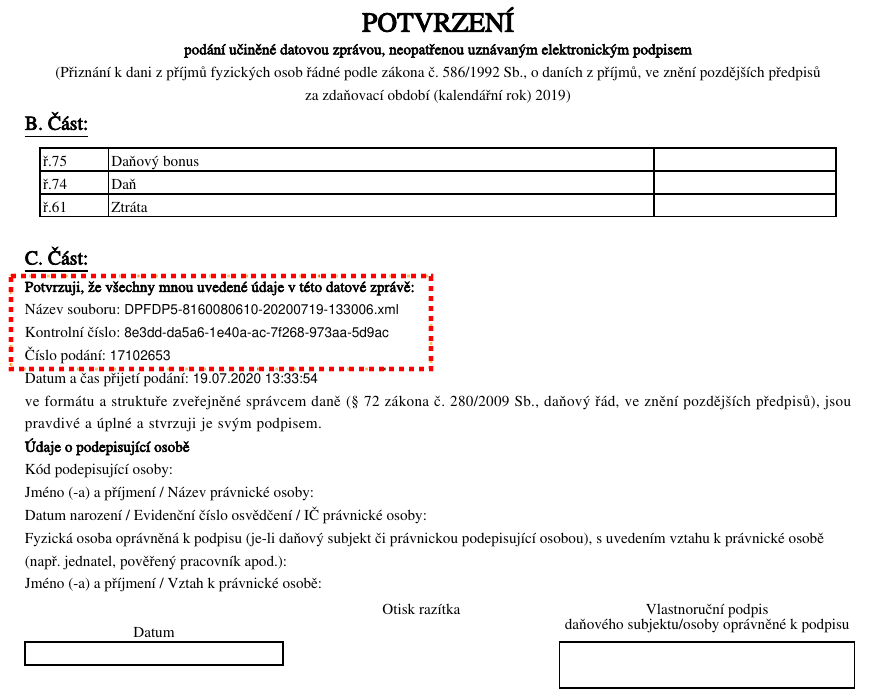
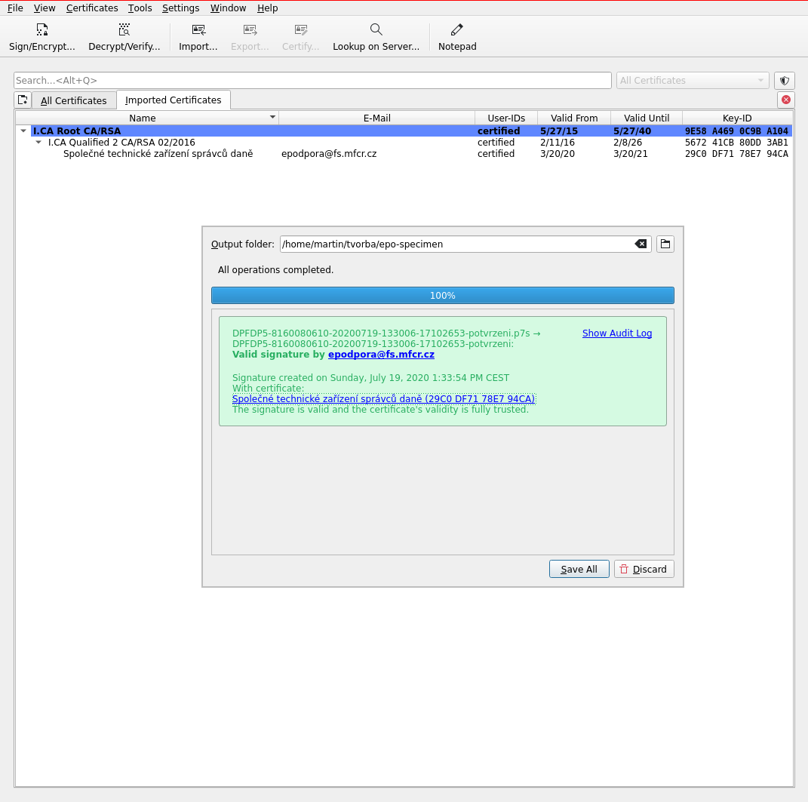

> </Pisemnost>
~~~

Tímto si tedy můžeme být jisti, že nám daňový portál opravdu podepsal data,
které jsme zadali do formuláře.

Jak si ale můžeme mít jistotu, že na papírovém potvrzení (e-tiskopisu)
podepisujeme stejnou informaci? Když se podrobně na e-tiskopis znovu podíváme,
vidíme následující údaje, které podání identifikují:

{ width=50% }

Jak jsem poznamenal už výše, nejsem si jistý z čeho a jak se kontrolní
číslo počítá, takže žádnou z těchto hodnot nelze brát jako checksum všech
formulářových dat. Ale na druhou stranu máme tyto údaje spolu se všemi
ostatními daty, co jsme vyplnily do formuláře, podepsané v PKCS#7 souboru od
finanční správy. Můžeme se tak podívat, že tyto údaje z papírového potvrzení
sedí k těm podepsaným:

~~~ {.kod}
$ xmlstarlet sel -t -v "/Pisemnost/Kontrola/Soubor/@Nazev" potvrzeni.pkcs7-data.xml; echo
DPFDP5-8160080610-20200719-133006
$ xmlstarlet sel -t -v "/Pisemnost/Kontrola/Soubor/@KC" potvrzeni.pkcs7-data.xml; echo
8e3ddda5a61e40aac7f268973aa5d9ac
$ xmlstarlet sel -t -v "/Pisemnost/Podani/@Cislo" potvrzeni.pkcs7-data.xml; echo
17102653
~~~

Jak daňová správa tak my tedy můžeme zpětně dokázat, co bylo přesně ve
formuláři podáno.

A nakonec pro jistotu dodám, že o něco uživatelsky přívětivější je pro validaci
podpisu v PKCS#7 potvrzení použít GUI nástroje typu
[Kleopatra](https://kde.org/applications/en/utilities/org.kde.kleopatra),
kde po naimportování a ověření kořenových certifikátů I. CA, lze popis
potvrzení pohodlně zvalidovat.

{ width=50% }

Validaci samotného podepsaného obsahu to ale samo o sobě pochopitelně neřeší.

## Moje dojmy

Samotná aplikace bohužel otrocky vychází z papírových formulářů, což je hádám
problém i současných zákonů a předpisů, takže musíte např. vypisovat k
jakému finančnímu úřadu patříte, i když později vyplňujete adresu trvalého
pobytu, ze které by tento detail šel odvodit. Jak [píše lupa.cz ve výše
odkazovaném článku](https://www.lupa.cz/clanky/pres-portal-obcana-se-muzete-prihlasit-i-k-danovemu-portalu-kolik-prace-to-realne-usetri/),
při přihlášení přes portál občana sice je možné některé osobní údaje nechat
předvyplnit, ale ideálně bych si představoval, že pokud už se přihlásím přes
občanku s čipem, žádné údaje které již stát o mě má nebudu vůbec muset znovu
zadávat.

Naopak dobrá ukázka využitého potenciálu strojového zpracování při
podání je vygenerování platebních pokynů včetně bankovního QR kódu.
Další pozitivní aspekt systému EPO je možnost z aplikace stáhnout veškerá data
nebo naopak data do aplikace nahrát. A to ve strukturovaném zdokumentovaném
formátu, který používá otevřené standardy. Otvírá to možnosti počítačového
zpracování dat, včetně tvorby pomocných aplikací (skutečně rozumně
navržené aplikace na ulehčení vyplňování daňového přiznání generují XML data,
která si pak můžete sami přes EPO podat).

Použití XML jako datového formátu tu imho dává smysl. I když bohužel se autorům
aplikace nepodařilo na řadě míst vyvarovat podivným hackům, jako např. při
vkládání XML do XML. Ale to by bylo na další XML flamewar ...

Škoda jen, že alespoň některé části aplikace EPO nejsou státem zveřejněny jako
open source knihovny, když už si to platíme z daní. Ještě více je ale škoda, že
příslušné zdrojáky nevlastní ani samotný stát. [Informační systém
ADIS](https://cs.wikipedia.org/wiki/Automatizovan%C3%BD_da%C5%88ov%C3%BD_informa%C4%8Dn%C3%AD_syst%C3%A9m),
kde data vyplněná přes EPO nakonec skončí, totiž zaujímá přední postavení v
[zástupu vendor lock-in systémů používané v naší státní
správě](https://archiv.ihned.cz/c7-66631500-oo1d8-c11990f2918a0b9).

Dále je těžké pochopit, proč stát lidi k používání el. podání nijak
pozitivně nemotivuje. Už jen to, že na úřadě nikdo nemusí formuláře ručně
přepisovat do počítače musí finančáku ušetřit spoustu času. Stát ale
"motivuje" jen ve speciálních případech, a pouze sankcemi. Pokud např. máte
datovou schránku a podáte přiznání jiným způsobem, [automaticky vám vzniká
neprominutelná pokuta ve výši 2000
Kč](https://www.zakonyprolidi.cz/cs/2009-280#p247a-2).
[Když ale povinnost používat datovou schránku nedodrží stát, nezbývá vám než se
v případě problémů bránit zpětně u
soudu](https://ekonom.ihned.cz/c7-66477830-oo1d8-d62cf79c4b4eff7). Problém
tohoto typu [už stihl řešit i Nejvyšší správní
soud](http://nssoud.cz/files/SOUDNI_VYKON/2016/0026_3As__1600045_20161209104735_prevedeno.pdf),
takže by dnes snad mělo být jasné, že úřad použít datovou schránku prostě musí,
a že tu nelze použít tzv. [fikci
doručení](https://cs.wikipedia.org/wiki/Pr%C3%A1vn%C3%AD_fikce) a považovat
nepřevzatý dopis za doručený. Na druhou stranu pokud ale dopis, co měl být
poslán datovou schránkou, skutečně převezmete, legitimizujete tím chybný úřední
postup a zaniká vám možnost si na něj dál stěžovat.
Ve výsledku tak takové prostředí spíše od zřízení datové schránky
odrazuje aniž by to propagaci el. podání nějak pomohlo.

## Budoucnost

Zhruba před rokem [se finanční správa pochlubila plánem, jak získat autorská
práva k systému
ADIS](https://www.financnisprava.cz/cs/financni-sprava/media-a-verejnost/tiskove-zpravy/tz-2019/zavislost-na-jedinem-dodavateli-IT-systemu-ADIS-po-30-letech-skonci-9969),
vyřešit problém s vendor lockinem a umožnit jeho modernizaci. Drobný zádrhel
ovšem je, že [na implementaci nového systému má ministerstvo financí omezený
čas](https://archiv.ihned.cz/c7-66622840-oo1d8-c94189555e5996d), a tak teď
těžko říct, jestli se to opravdu podaří vyřešit.

Kromě toho se už nějaký čas připravuje novela *daňového řádu*, která by mohla
některé problémy zmiňované výše řešit. Automatická [pokuta za nepodání daňového
přiznání pro držitele datových schránek by měla být
omezena](https://www.lupa.cz/clanky/elektronicky-bic-na-danove-poplatniky-by-mohl-zmirnit/)
a naopak při elektronickém podání by se měla lhůta pro podání prodloužit o
měsíc.

Novela také zahrnuje vznik tzv. "online finančního úřadu" [MOJE
daně](https://www.mojedane.cz/), který vznikne rozšířením a
modernizací současného systému [daňových informačních schránek](https://www.financnisprava.cz/cs/dane-elektronicky/danovy-portal/danova-informacni-schranka),
o kterém jsem se tu zatím vůbec nezmiňoval. Pokud chápu [stručný popis nového
portálu](https://www.penize.cz/dan-z-prijmu-fyzickych-osob/414851-dane-konecne-vyridite-online-schillerove-vlajkova-lod-proplula)
dobře, půjde o další možnost jak daně podat, která by měla umožnit
nejen předvyplnit data co finanční správa už ví, ale i dostat se ke stavu a
údajům z předchozích podání a plateb. Mělo být také možné se do systému
přihlásit i bez datové schránky, kvalifikovaného certifikátu nebo e-občanky.
Jak to má ale přesně fungovat jsem nedohledal.

Já teď zvažuji možnosti, jak bych příště podal přiznání zcela elektronicky.
Nová občanka s čipem vypadá na první pohled zajímavě, ale když jsem si začal
dohledávat detaily, byl jsem z toho poněkud rozpačitý. Možná nakonec skončím
u datové schránky. A co vy? Máte kvalifikovaný podpisový certifikát, datovou
schránku nebo novou občanku s čipem?

<!-- Anketa

Daňové přiznání:

- nepodávám (nejsem daňový rezident ČR, nemám práci, ...)
- podává za mně někdo jiný (zaměstnavatel, daňový poradce, ...)
- podávám sám

Pokud podávám přiznání sám, tak použiji:

- papírový formulář, který ručně vypíšu a pak donesu na úřad
- interaktivní formulář pro adobe acrobat reader, vytisknu a doručím na úřad
- nějaký neoficiální spreadsheet, který vytisknu a doručím na úřad
- EPO, ale formulář jen vytisknu a pak doručím na úřad
- EPO a podám bez el. podpisu, na úřad dodám potvrzení
- EPO a podám podepsané kvalifikovaným certifikátem
- EPO a podám přes datovou schránku
- EPO s přihlášením přes Portál občana
- jiný způsob (napíšu v diskusi)
-->
