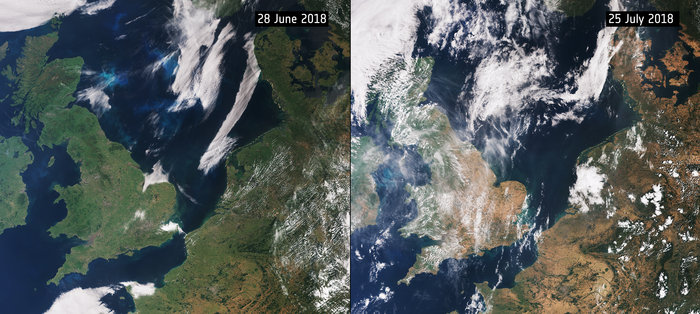

---
title: Copernicus a Copyright
author: marbu
lang: cs-CZ
rights: cc by-sa 4.0
...

<!-- draft

* intro: obrázek v novinách
* obrázek
* linky na noviny a zdroj
* licence
* proč neodkazovat na zdroj?
* copernicus a sentinel
* openstreet map
* stahování dat
* copyrigh filter - zabanovali by mě? odkazy na název článku?

-->

Na konci července proběhlo médii srovnání 2 satelitních záběrů pořízených se
zhruba měsíčním odstupem, na kterých je vidět, jak se za tu dobu projevilo na
vegetaci v krajině letošní sucho. Což je samo o sobě sice velice zajímavé, ale
chci se tu na to podívat spíš z pohledu odkazování na primární zdroje a
používání dat s otevřenou licencí. Což je vzhledem k finišující reformně
autorského práva také více méně aktuální.

<!--break-->

